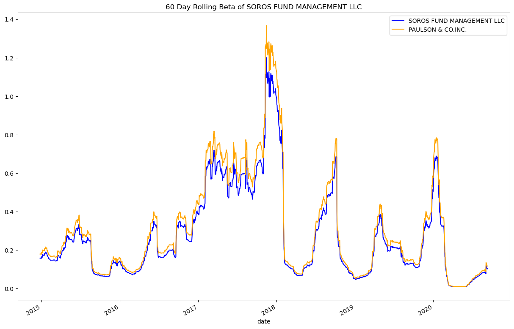

# Analyzing Portfolio Risk and Return

---

## Introduction 

The python script reads in a timestamp csv file filled with four different investment funds (Soros Fund Managment, Paulson & Co Inc., Tiger Global Management, and Berkshire Hathaway) and the S&P 500 closing prices within the time range of 10/01/2014 to 09/11/2020. Using this imported data, the script will be able to determine the portfolio risk of all funds, as well as, determine the best return. 

---

## Folders 

[Example CSV File](Columbia_Module_4/Resources/whale_navs.csv)

[Risk Return Analysis Python Script](Columbia_Module_4/risk_return_analysis.ipynb)

---

## Resources

The script uses Python 3.7. The code will import the following libraries and dependencies: Pandas, Numpy, Pathlib, and Matplotlib.

```python
import pandas as pd
import numpy as np
from pathlib import Path 
%matplotlib inline
```

[For more information on Pandas](https://pandas.pydata.org/)

[For more information on Numpy](https://numpy.org/)

[For more infomration on Pathlib](https://docs.python.org/3/library/pathlib.html)

[For more information on Matplotlib](https://matplotlib.org/)

---

## Usage

After reading the csv file, using `pd.read_csv()`, the script calculates the daily returns by using the `pct_change()` function and then `dropna` to find teh daily returns of the four funds and S&P 500. 

```python 
whale_navs_daily_returns = whale_navs.pct_change().dropna()
```

The script goes one step further, by isolating the daily returns by each fund and S&P 500 to have more control over visualization tactics. Using the Soros Management Fund as an example: 

```python
daily_return_soros = whale_navs.iloc[:,0].pct_change().dropna()
```

 The script uses the the `.plot()` to show a line graph of the daily returns. This allows a visual representation of the data. 


Next, using the `cumprod()` function, the script calculates the cumulative returns during the date range specified in the CSV file. 

```python
cumulative_returns = (1 + whale_navs_daily_returns).cumprod()
```

Visualizing the cumulative returns allows for an easier analysis. 


We can analyze the volatility by calculating the standard deviation. The `std()` is perfect for this. Sorting the values will allow us to see the descending to ascending view of volatility.

```python 
whale_navs_std = whale_navs_daily_returns.std()
whale_navs_std.sort_values()
```

Next, we can use the Sharpe Ratio to determine the risk-adjusted returns based on the four funds. To do this, the script takes the annual average return. 252 is used as a constant for the amount of potential tradings days in a year. 

```python
whale_navs_avg = whale_navs_daily_returns.mean() * 252
```

> A plot of the results of the Sharpe Ratio calculation can be found below: 


Lastly, the script looks to further look at the various funds by calculating the beta between two funds. 

> Side Note: The script uses Soros Fund Management LLC and Paulson & CO Inc. as a comparison. 

Calculating the beta in this script includes looking at the variance on a 60 day period for the S&P 500. 

```python 
var_sp_500 = daily_return_sp500.rolling(window=60).var()
```

Next, we can calculate the co-variance of our chosen fund. In this example, this will be the Soros Fund Management LLC. 

> Side Note: We are finding the co-variance in relation to our benchmark index, the S&P 500. Dividing this by the variance of the S&P 500 will give us the beta ratio. 

```python
soros_cov = whale_navs_daily_returns['SOROS FUND MANAGEMENT LLC'].cov(whale_navs_daily_returns["S&P 500"])
soros_beta = soros_cov / var_sp_500
```

Doing the same steps with the other fund, Paulson & Co Inc., we can visualize the beta outputs with the graph shown below. 



---

## Contributors: 

Alex Novis 

Columbia Fintech Bootcamp


